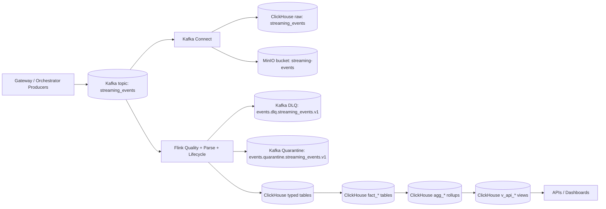
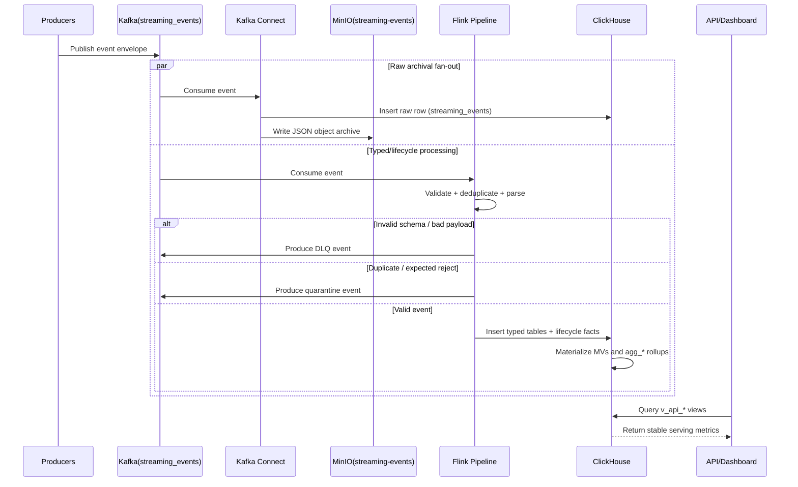

# System Overview

## Purpose

The Livepeer Analytics platform ingests streaming telemetry from gateways and orchestrators, preserves raw events for replay/audit, computes curated facts, and serves stable API views for product and operations use cases.

Primary outcomes:

- Real-time GPU/orchestrator performance metrics
- Network demand and capacity visibility
- SLA/compliance monitoring
- Replay-safe historical analytics

## System at a Glance

| Layer | Primary responsibility | Key outputs |
|---|---|---|
| Event producers | Emit streaming events | Kafka topic `streaming_events` |
| Kafka | Durable ordered transport | Source stream for Connect and Flink |
| Kafka Connect | Raw archival fan-out | ClickHouse raw table + MinIO objects |
| Flink | Validation, dedup, parsing, stateful lifecycle logic | Typed tables + lifecycle facts |
| ClickHouse | Storage, MVs, rollups, serving views | `fact_*`, `agg_*`, `v_api_*` |
| API/Dashboard consumers | Read-only analytics consumption | Product APIs, dashboards |

## End-to-End Data Flow

## Runtime Sequence (Ingest, Archive, Serve)

## Architecture Principles

### Separation of Concerns

| Component | Responsibility boundary |
|---|---|
| Kafka | Durable, ordered event transport |
| Kafka Connect | Raw archival only (ClickHouse raw + MinIO) |
| Flink | Validation, dedup, stateful correctness, lifecycle derivation |
| ClickHouse | Persistent storage, non-stateful materialization, serving views |
| Consumers | Read-only access via stable `v_api_*` contracts |

## Runtime Topology

1. Producers publish events to Kafka topic `streaming_events`.
2. Kafka Connect persists raw events to ClickHouse and MinIO.
3. Flink consumes `streaming_events`, runs quality gates and parsing, then writes typed/lifecycle facts.
4. ClickHouse MVs produce non-stateful facts; rollups and serving views power APIs and dashboards.

## Technology Baseline

| Technology | Version / image | Notes |
|---|---|---|
| Kafka | `apache/kafka:3.9.0` | Core event transport |
| Flink | `flink:1.20.3-java11` | Stream processing and lifecycle logic |
| ClickHouse | `clickhouse/clickhouse-server:24.11` | Analytics storage and serving |
| Grafana | `grafana/grafana:latest` | Dashboarding on ClickHouse |
| MinIO | deployed in stack | Raw event object archive |
| Java toolchain | Java 11 + Maven | Java 17 module opens in test runtime where needed |

## Component Details

### Kafka Connect Architecture

Connect worker runs dual sinks on `streaming_events`.

| Sink / setting | Property | Value / default | Purpose |
|---|---|---|---|
| `clickhouse-raw-events-sink` | `tasks.max` | `2` | Parallel raw ingest to ClickHouse |
| `clickhouse-raw-events-sink` | insert mode | buffered async insert | Efficient writes to `livepeer_analytics.streaming_events` |
| `minio-raw-events-sink` | `tasks.max` | `2` | Parallel object archival |
| `minio-raw-events-sink` | format | JSON | Durable replay/audit payload preservation |
| `minio-raw-events-sink` | partitioner | `DefaultPartitioner` | Topic/partition-oriented object layout |
| `minio-raw-events-sink` | `flush.size` | connector-defined | Object rollover control |
| `minio-raw-events-sink` | `rotate.interval.ms` | connector-defined | Time-based object rollover |
| Connect worker | `errors.tolerance` | `all` | Continue processing with logged errors |
| Connect worker | error logging | enabled | Operational diagnostics |

### MinIO Object Layout

| Item | Value | Notes |
|---|---|---|
| Bucket | `streaming-events` | Raw event archive target |
| Path pattern | Topic/partition-oriented | Enables bounded replay/backfill scans |
| File rolling | `flush.size` and `rotate.interval.ms` | Controlled by sink connector properties |

### Apache Flink Architecture

Processing stages:

1. Source ingestion from Kafka
2. Quality gate (schema validation + dedup keying)
3. Dedup state with TTL
4. Parsing into typed payload families
5. Stateful lifecycle/session derivation
6. ClickHouse sinks for typed, lifecycle, and derived facts

Stateful lifecycle contracts are implemented in:

- `flink-jobs/src/main/java/com/livepeer/analytics/lifecycle/WorkflowSessionStateMachine.java`
- `flink-jobs/src/main/java/com/livepeer/analytics/lifecycle/WorkflowLatencyDerivation.java`

#### Flink Error Handling Strategy

| Case | Action | Destination |
|---|---|---|
| Schema/validation failure | Reject event | `events.dlq.streaming_events.v1` |
| Duplicate/expected reject | Quarantine event | `events.quarantine.streaming_events.v1` |
| Oversized sink row | Route typed rows to DLQ; drop oversize DLQ/quarantine envelopes to prevent recursion | DLQ safety path |
| Replay processing | Preserve deterministic dedup and replay metadata (`__replay`) | Replay-safe correctness |

### ClickHouse Architecture

| Storage class | Examples | Production role |
|---|---|---|
| Raw ingest | `streaming_events`, DLQ/quarantine tables | Immutable audit/replay inputs |
| Typed event tables | `ai_stream_status`, `stream_trace_events`, `network_capabilities` | Parsed event surfaces |
| Curated facts | `fact_*` | Canonical analytical facts |
| Rollups | `agg_*` | Query-efficient aggregates |
| Serving views | `v_api_*` | Stable API/dashboard contracts |

Serving-grain note:
- `v_api_network_demand` is model-aware at `(hour, gateway, region, pipeline, model_id)`.
- Consumers joining demand with pipeline-only datasets must pre-aggregate by pipeline (or include `model_id` when available).

Materialization model:

- Non-stateful projections are emitted by ClickHouse MVs.
- Stateful lifecycle outputs are emitted by Flink into target facts.
- Schema source of truth: `configs/clickhouse-init/01-schema.sql`.

## Ownership and Execution Split

### Flink Owns Correctness

- Schema validation and dedup/quarantine policy
- Deterministic session identity and lifecycle classification
- Stateful correlations and attribution quality derivation

### ClickHouse Owns Serving

- Non-stateful 1:1 materialized projections
- Rollups and API-serving views
- Freshness/parity health queries

### Stateful Facts (Flink-emitted)

- `fact_workflow_sessions`
- `fact_workflow_session_segments`
- `fact_workflow_param_updates`

These facts require ordering-aware correlation and classification (session identity, startup outcomes, swap detection, attribution confidence).

### Lifecycle Attribution Steady State

Lifecycle attribution uses a bounded multi-candidate capability cache per hot wallet key (`local_address`).

Selection flow:
1. Resolve hot wallet from signal orchestrator identity.
2. Load candidate capability snapshots for that wallet.
3. Resolve canonical semantics through `PipelineModelResolver`:
   - canonical `pipeline` (workflow class),
   - canonical `model_id` (model label),
   - compatibility `model_hint`.
4. Filter candidates by compatibility first (`model_hint` vs candidate `model_id`).
5. Rank compatible candidates by deterministic freshness rules:
   - exact timestamp match
   - nearest prior snapshot within TTL
   - nearest snapshot within TTL
   - stale fallback class (lowest confidence)
6. Apply selected candidate model/GPU attribution to lifecycle state.

Safety rules:
1. If no compatible candidate exists, do not overwrite model/GPU attribution on that signal.
2. Lifecycle signals are never dropped due to attribution mismatch/no-candidate conditions.
3. Candidate cache is bounded and TTL-pruned to keep lookup O(k) with small bounded `k`.

This design prevents mixed-model drift when one hot wallet advertises multiple model families (for example streamdiffusion and llama) in interleaved capability snapshots.

Compatibility note:
- Resolver mode is configurable via `LIFECYCLE_PIPELINE_MODEL_MODE`.
- Default `legacy_misnamed` supports current upstream payloads where stream-event `pipeline`
  carries model-like values.
- Future upstream correction to native pipeline/model fields should require mode transition, not
  lifecycle refactors.

### Non-Stateful Facts (ClickHouse MV-emitted)

- `fact_stream_status_samples`
- `fact_stream_trace_edges`
- `fact_stream_ingest_samples`

### Why This Split

- Stateful logic in ClickHouse SQL is harder to test and keep deterministic across replays.
- Non-stateful projections in Flink create repetitive mapper/sink code without equivalent correctness gain.
- This split keeps complex correctness logic centralized in Flink and high-volume reshaping close to ClickHouse storage.

## Runtime Environment Variables

### Flink Main Pipeline

| Variable | Default | Purpose |
|---|---|---|
| `QUALITY_KAFKA_BOOTSTRAP` | `kafka:9092` | Kafka bootstrap servers for quality/main job |
| `QUALITY_INPUT_TOPIC` | `streaming_events` | Primary ingest topic |
| `QUALITY_DLQ_TOPIC` | `events.dlq.streaming_events.v1` | DLQ output topic |
| `QUALITY_QUARANTINE_TOPIC` | `events.quarantine.streaming_events.v1` | Quarantine output topic |
| `QUALITY_GROUP_ID` | `flink-quality-gate-v1` | Consumer group id |
| `QUALITY_DEDUP_TTL_MINUTES` | `1440` | Dedup state TTL |
| `QUALITY_SUPPORTED_VERSIONS` | `1,v1` | Accepted schema versions |
| `QUALITY_METRICS_RATE_WINDOW_SEC` | `60` | Internal metrics rate window |
| `CLICKHOUSE_URL` | `http://clickhouse:8123` | ClickHouse HTTP endpoint |
| `CLICKHOUSE_DATABASE` | `livepeer_analytics` | ClickHouse target database |
| `CLICKHOUSE_USER` | `analytics_user` | ClickHouse user |
| `CLICKHOUSE_PASSWORD` | none | ClickHouse password |
| `CLICKHOUSE_SINK_MAX_BATCH_SIZE` | `1000` | Max rows per sink batch |
| `CLICKHOUSE_SINK_MAX_IN_FLIGHT` | `2` | Max concurrent sink batches |
| `CLICKHOUSE_SINK_MAX_BUFFERED` | `10000` | Max buffered rows |
| `CLICKHOUSE_SINK_MAX_BATCH_BYTES` | `5000000` | Max batch payload bytes |
| `CLICKHOUSE_SINK_MAX_TIME_MS` | `1000` | Max batch flush interval |
| `CLICKHOUSE_SINK_MAX_RECORD_BYTES` | `1000000` | Max single record payload bytes |

### Replay Job

| Variable | Default | Purpose |
|---|---|---|
| `REPLAY_KAFKA_BOOTSTRAP` | `QUALITY_KAFKA_BOOTSTRAP` | Kafka bootstrap for replay job |
| `REPLAY_DLQ_TOPIC` | `QUALITY_DLQ_TOPIC` | Replay source topic |
| `REPLAY_OUTPUT_TOPIC` | `QUALITY_INPUT_TOPIC` | Replay target topic |
| `REPLAY_START_EPOCH_MS` | none | Inclusive replay window start |
| `REPLAY_END_EPOCH_MS` | none | Exclusive replay window end |

## Canonical Lifecycle Concepts

- Session identity is deterministic and replay-safe.
- Startup/failure/swap semantics are defined in `docs/data/SCHEMA_AND_METRIC_CONTRACTS.md`.
- Canonical orchestrator identity should use capability-based normalization (`local_address`) when available.
- Parameter updates (`ai_stream_events.type='params_update'`) are lifecycle markers, not segment boundaries in v1.

## Open Areas and Related Docs

- Canonical open issues/backlog: `docs/references/ISSUES_BACKLOG.md`
- Data contract details: `docs/data/SCHEMA_AND_METRIC_CONTRACTS.md`
