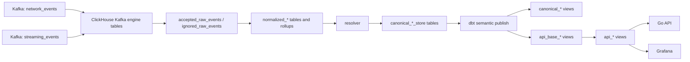
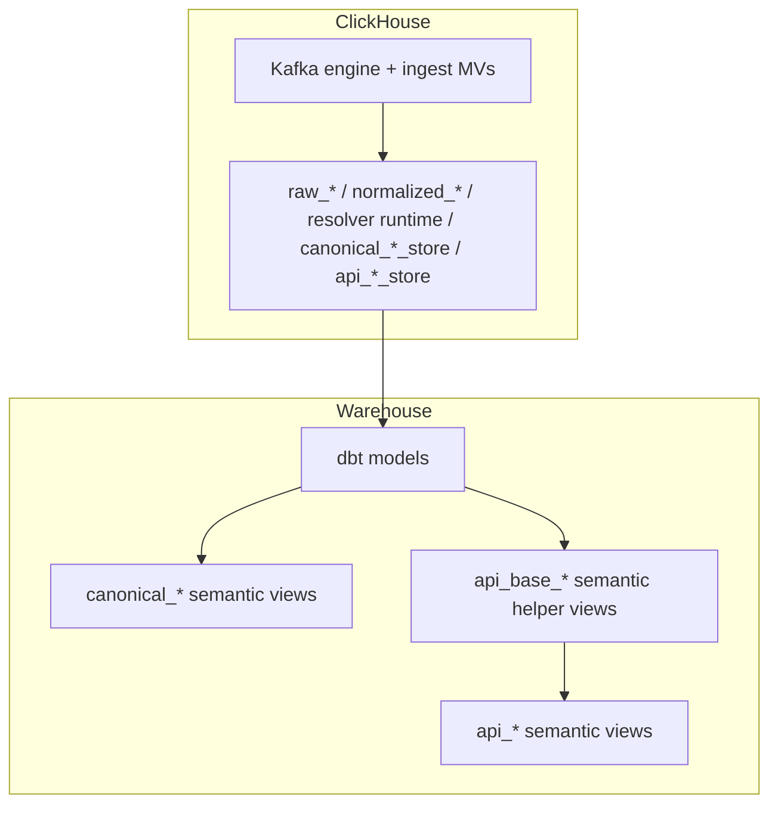
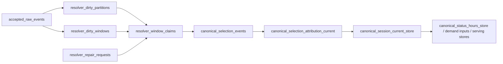
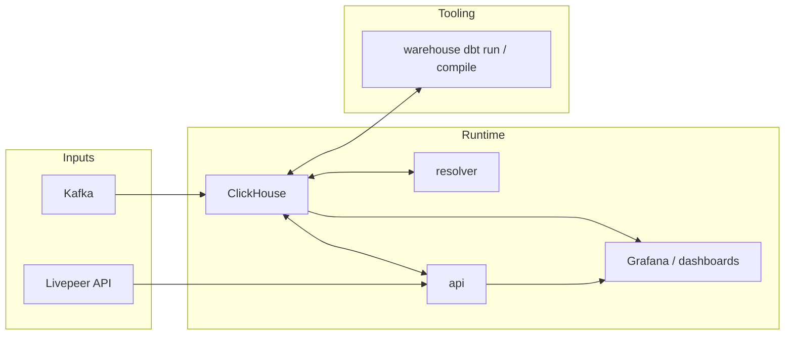

# System Visuals

This document gives the supported end-to-end view of the analytics system.
For the detailed component rules, see [`architecture.md`](architecture.md).
For operational modes and recovery procedures, see [`../operations/run-modes-and-recovery.md`](../operations/run-modes-and-recovery.md).

## End-To-End Data Flow

## ClickHouse And dbt Responsibilities

## Resolver Publication Spine

## Standard Deployment Topology

## Read Priorities

- API-first reads come from resolver-fed org/window serving stores and their dbt-published `api_*` views.
- Ingest and replay correctness come next: accepted raw, normalized tables, and resolver repair state are optimized for append and bounded repair.
- Dashboards should prefer published `api_*` views and `agg_*` tables rather than rebuilding semantics from raw history.
